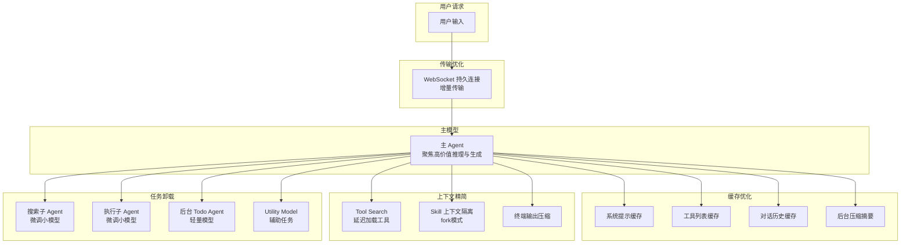

# VS Code Token 优化关键技术详解

> 基于 VS Code v1.118–v1.124 (2026年4月–6月) 版本更新内容整理

随着 GitHub Copilot 于 2026 年 6 月 1 日转向按用量计费（Usage-based Billing），VS Code 团队系统性地实施了一系列 Token 优化策略，在不降低 Agent 质量的前提下显著减少 Token 消耗。

---

## 目录

- [1. Prompt 缓存效率优化](#1-prompt-缓存效率优化)
- [2. Tool Search — 延迟加载工具](#2-tool-search--延迟加载工具)
- [3. Agentic 子 Agent 工具](#3-agentic-子-agent-工具)
- [4. 终端输出压缩](#4-终端输出压缩)
- [5. 后台 Todo Agent](#5-后台-todo-agent)
- [6. WebSocket 持久连接](#6-websocket-持久连接)
- [7. 独立 Skill 上下文隔离](#7-独立-skill-上下文隔离)
- [8. 可配置 Utility Model](#8-可配置-utility-model)
- [9. Advanced Autopilot — 智能循环终止](#9-advanced-autopilot--智能循环终止)
- [10. 合并工具调用减少往返](#10-合并工具调用减少往返)
- [总结](#总结)

---

## 1. Prompt 缓存效率优化

**引入版本**: v1.118  
**效果**: 超过 93% 的请求内容从缓存复用；Anthropic 模型约 10 倍降低重复内容计费  
**是否需要手动开启**: ❌ 否 — 默认启用，框架自动处理

### 背景

在多轮 Agent 工作流中，每一轮请求都包含大量重复内容（系统提示、工具定义、历史对话等）。如果这些内容每次都被当作新输入计费，成本会极高。LLM 提供商（如 Anthropic）支持 Prompt Caching 机制——命中缓存的 Token 以约 1/10 的价格计费。

### 核心子技术

#### 1.1 战略性缓存断点放置

VS Code 审计了缓存断点的放置位置，确保它们位于**稳定边界**：

| 断点位置 | 说明 |
|----------|------|
| 系统提示末尾 | 系统提示通常不变，是最稳定的缓存前缀 |
| 工具列表末尾 | 工具定义在会话期间保持不变 |
| 最近工具轮次末尾 | 最近的工具调用结果是模型需要的即时上下文 |
| 对话轮次边界 | 在每轮对话转折点设置断点 |

**结果**：一旦 Agent 会话开始运行，每次请求中超过 93% 的内容从缓存复用。

#### 1.2 缓存稳定的系统提示和工具列表

缓存前缀的有效性取决于前面的字节完全一致。VS Code 团队识别并消除了导致"字节漂移"的来源：

- **静态工具描述**：`vscode_renameSymbol` 和 `vscode_listCodeUsages` 使用静态描述而非根据已加载语言动态生成的描述。这样当语言扩展在会话中途激活时，不会改变请求内容从而重置缓存。
- **可预测的工具排序**：延迟工具和非延迟工具分组排列，确保工具数组的字节在各轮次间完全一致。

相关设置：`chat.experimental.symbolTools.cacheStable`

#### 1.3 缓存友好的后台压缩

随着会话变长，VS Code 在后台摘要旧轮次以防止上下文溢出：

- 模型在需要时仍可查找早期轮次的工具结果和细节
- 后台摘要复用与主 Agent 相同的缓存上下文
- 使多轮长会话的效率显著提升

#### 1.4 最后两条消息断点策略

在长 Agent 会话中，较早的轮次最终会滑出可缓存窗口。VS Code 将缓存断点锚定在：

1. 系统提示
2. 工具列表
3. **最近两条消息**

相关设置：`github.copilot.chat.anthropic.cacheBreakpoints.lastTwoMessages`

### 工作原理示意

```
┌─────────────────────────────────────────────────────┐
│  System Prompt (稳定，完全缓存)                       │ ← 断点 1
├─────────────────────────────────────────────────────┤
│  Tools List (静态描述，有序排列)                       │ ← 断点 2
├─────────────────────────────────────────────────────┤
│  历史对话 (摘要后的旧轮次)                            │
├─────────────────────────────────────────────────────┤
│  最近 2 条消息                                       │ ← 断点 3
├─────────────────────────────────────────────────────┤
│  当前新输入 (唯一真正的新 Token)                      │
└─────────────────────────────────────────────────────┘
```

---

## 2. Tool Search — 延迟加载工具

**引入版本**: v1.118  
**效果**: Anthropic 模型节省高达 20% Token；OpenAI 模型（GPT-5.4+）类似或更好  
**是否需要手动开启**: ⚠️ 部分 — Anthropic 模型默认启用；OpenAI 模型需开启 `github.copilot.chat.responsesApi.toolSearchTool.enabled`

### 背景

VS Code Agent 拥有大量工具（文件操作、终端、Git、语言服务、MCP 等），但每轮请求只使用其中少数。将所有工具的 Schema 都放入上下文会浪费大量 Token。

### 核心设计

将工具集分为两组：

| 类别 | 数量 | 行为 |
|------|------|------|
| **始终可用核心工具** | ~30 个 | 始终包含在每轮请求中 |
| **延迟工具 (Deferred Tools)** | 其余所有 | Schema 不加载，直到模型主动请求 |

### 工作流程

```
1. 模型接收请求，上下文中只有 ~30 个核心工具
2. 如果模型需要延迟工具的能力，调用 tool_search
3. tool_search 在客户端运行嵌入语义搜索
4. 返回最匹配的工具 Schema
5. 模型在后续步骤中使用该工具
```

### 技术细节

- 核心工具覆盖 **~88%** 的实际工具调用
- `tool_search` 使用嵌入向量进行语义匹配，模型用自然语言描述需要的能力
- 每轮工具占用大幅缩小，且前缀保持稳定可缓存

### 适用范围

| 模型 | 状态 | 设置 |
|------|------|------|
| Anthropic (Claude Sonnet 4.5+, Opus 4.5+) | 默认启用 | — |
| OpenAI (GPT-5.4, GPT-5.5) | 通过 Responses API 逐步推出 | `github.copilot.chat.responsesApi.toolSearchTool.enabled` |

---

## 3. Agentic 子 Agent 工具

**引入版本**: v1.118  
**效果**: 经过一个月灰度测试，Token 节省高达 20%  
**是否需要手动开启**: ❌ 否 — 灰度逐步推出，自动启用

### 背景

Agent 工作流中，代码搜索和终端执行是两个高 Token 消耗场景：
- 搜索需要多次工具调用来找到正确的上下文
- 终端输出往往冗长且噪音大

### 3.1 Agentic Search Tool（搜索子 Agent）

#### 工作原理

```
主 Agent                              搜索子 Agent (小模型)
   │                                       │
   │── "找到用户认证相关的代码" ──────────────→│
   │                                       │── grep_search
   │                                       │── file_search
   │                                       │── semantic_search
   │                                       │── read_file
   │                                       │
   │←── 最相关的代码片段 ────────────────────│
   │
   │ (继续推理和编辑)
```

#### 关键特性

- 底层使用**微调小语言模型**（成本远低于主模型）
- 训练目标：在最小轮次内并行运行多次搜索
- 严格的作用域限制：只能执行搜索相关操作
- 仅将最终相关结果返回主模型

### 3.2 Agentic Execution Tool（执行子 Agent）

#### 工作原理

```
主 Agent                              执行子 Agent (小模型)
   │                                       │
   │── "运行测试并报告结果" ───────────────→│
   │                                       │── run_in_terminal("npm test")
   │                                       │── 读取输出
   │                                       │── 过滤关键信息
   │                                       │
   │←── 精炼后的测试结果 ───────────────────│
   │
   │ (根据结果决定下一步)
```

#### 关键特性

- 只能执行终端命令（作用域严格限制）
- **最多 10 次终端调用/每次调用**，防止无限循环
- 过滤冗长输出，只传回编码 Agent 真正需要的信息
- 将冗余输出从主模型的 Token 使用中剥离

### 设计哲学

> 将昂贵的大模型专注于**推理和生成**，将信息收集和命令执行卸载到便宜的小模型。

---

## 4. 终端输出压缩

**引入版本**: v1.120 (Preview) → v1.121 (扩展覆盖)  
**设置**: `chat.tools.compressOutput.enabled`  
**是否需要手动开启**: ✅ 是 — 需手动开启 `chat.tools.compressOutput.enabled`

### 背景

终端命令（如 `git diff`、`npm install`、`pytest`）的输出经常非常冗长，可能消耗模型上下文窗口的很大比例，留给代码和推理的空间变少。

### 压缩规则

#### v1.120 初始覆盖

| 命令类型 | 压缩策略 |
|----------|----------|
| `git diff` | 折叠大段未变化的 Hunk |
| lockfile/snapshot diff | 完全丢弃 |
| `ls -l` | 缩减为文件/目录名列表 |
| `npm install` | 剥离进度条、弃用警告、审计摘要 |

#### v1.121 扩展覆盖

| 命令类型 | 压缩策略 |
|----------|----------|
| `pytest` / `jest` / `cargo test` | 移除重复的测试进度输出 |
| `tsc` (TypeScript 编译) | 精简编译器输出 |
| Docker 命令 | 过滤层拉取进度 |
| 包管理器 (npm/yarn/pip) | 剥离下载进度和非关键警告 |

### 透明性

- 压缩后的输出会附带一个简短 Banner，说明应用了哪些过滤器
- 模型可以看到哪些过滤器被触发
- 模型可以请求原始文本（如果需要未压缩的内容）

### v1.121 额外优化：后台终端自动清理

- Agent 创建的后台终端在命令完成后自动释放
- 命令输出保留在 Chat UI 中
- 减少长会话中的终端列表堆积和资源消耗

---

## 5. 后台 Todo Agent

**引入版本**: v1.119  
**设置**: `github.copilot.chat.agent.backgroundTodoAgent.enabled`  
**状态**: 实验性，默认关闭  
**是否需要手动开启**: ✅ 是 — 实验性，默认关闭，需手动开启 `github.copilot.chat.agent.backgroundTodoAgent.enabled`

### 背景

Todo 列表帮助 Agent 在复杂多步任务中保持方向感。但主模型每次调用 Todo 工具都需要消耗 Token——在长会话中这些成本累积可观。

### 工作原理

```
┌──────────────────────────────────────────────────────┐
│  主 Agent (大模型)                                     │
│  ├── 聚焦实际编码任务                                  │
│  ├── 不持有 Todo 工具                                  │
│  └── 不花 Token 在任务管理上                           │
└──────────────────────┬───────────────────────────────┘
                       │ (活动事件流)
                       ▼
┌──────────────────────────────────────────────────────┐
│  后台 Todo Agent (轻量小模型)                          │
│  ├── 监控主 Agent 的活动                               │
│  ├── 自动标记已完成的任务                               │
│  ├── 更新进行中的任务状态                               │
│  └── 独立运行，不消耗主模型上下文                       │
└──────────────────────────────────────────────────────┘
```

### 优势

- 主模型完全不需要调用 Todo 工具 → 每次工具调用节省的 Token 累积显著
- 任务跟踪的认知负担从大模型转移到小模型
- 用户仍可通过 `#todo` 手动将 Todo 工具添加到请求中（此时后台 Agent 不运行）

---

## 6. WebSocket 持久连接

**引入版本**: v1.118  
**效果**: OpenAI 模型速度提升 12%  
**配置**: 自动启用，无需手动配置  
**是否需要手动开启**: ❌ 否 — 自动启用，无需手动配置

### 背景

传统的 Agent 工作流中，每一轮对话都开启一个新的 HTTP 请求，需要传输完整的对话历史。在多工具调用的 Agent 会话中（可能有数十轮来回），重复传输大量相同数据。

### 技术实现

| 方面 | 传统 HTTP | WebSocket 模式 |
|------|-----------|----------------|
| 连接方式 | 每轮新建连接 | 保持持久连接 |
| 传输内容 | 完整对话历史 | 仅新输入 + 前一 response ID |
| 状态管理 | 客户端维护 | 服务器保留对话状态 |
| 延迟 | 每轮有连接开销 | 后续轮次显著降低 |

### 适用范围

- 支持 WebSocket 模式的 OpenAI 模型（通过 Responses API）
- 对多工具调用的 Agent 工作流效果最显著

---

## 7. 独立 Skill 上下文隔离

**引入版本**: v1.118  
**设置**: `github.copilot.chat.skillTool.enabled`  
**状态**: 实验性  
**是否需要手动开启**: ✅ 是 — 实验性，需手动开启 `github.copilot.chat.skillTool.enabled`，并在 SKILL.md 中设置 `context: fork`

### 背景

Skill（技能）在执行时可能进行多步工具调用或引入大量参考材料。如果这些辅助内容全部进入主对话上下文，会：
- 挤占有限的上下文窗口
- 降低后续响应的质量
- 使模型"分心"于非核心信息

### 工作原理

```yaml
# SKILL.md 前置元数据
---
name: my-skill
description: My skill description
context: fork    # ← 关键配置：独立上下文
---
```

当设置 `context: fork` 时：

```
主对话上下文                          Skill 子 Agent 上下文
┌───────────────────┐                ┌───────────────────┐
│ 用户问题           │                │ Skill 指令        │
│ 对话历史           │ ──触发 Skill─→ │ 工具调用          │
│ 代码上下文         │                │ 参考材料          │
│                   │                │ 中间推理          │
│                   │ ←─精炼结果──── │                   │
│ + Skill 结果      │                └───────────────────┘
└───────────────────┘                    (执行完后丢弃)
```

### 优势

- 主上下文保持聚焦和精简
- Skill 可以自由使用大量工具和参考材料而不影响主对话
- 后续对话质量不被辅助内容稀释

---

## 8. 可配置 Utility Model

**引入版本**: v1.121  
**设置**: `chat.utilityModel`、`chat.utilitySmallModel`  
**是否需要手动开启**: ⚠️ 可选 — 默认已有内置模型，仅在需要自定义模型时手动配置 `chat.utilityModel` / `chat.utilitySmallModel`

### 背景

VS Code 在后台使用模型处理多种辅助任务，这些任务不需要最强大（也最昂贵）的模型：

| 辅助任务 | 说明 |
|----------|------|
| 生成对话标题 | 为聊天会话创建简短标题 |
| 摘要生成 | 压缩长对话历史 |
| Commit 信息 | 根据 diff 生成提交描述 |
| 重命名建议 | 变量/函数重命名推荐 |
| Prompt 分类 | 判断用户意图类别 |
| 意图检测 | 决定使用哪些工具 |

### 配置方式

```json
{
  // 通用辅助任务模型
  "chat.utilityModel": "gpt-4o-mini",
  
  // 快速轻量任务模型（推荐使用快速且便宜的模型）
  "chat.utilitySmallModel": "gpt-4o-mini"
}
```

### 与 BYOK 结合

从 v1.122 开始，即使没有 GitHub 登录，也可以通过 BYOK 配置 Utility Model，支持完全离线工作流（如 Ollama 本地模型）。

---

## 9. Advanced Autopilot — 智能循环终止

**引入版本**: v1.124  
**设置**: `chat.autopilot.advanced.enabled`  
**状态**: 实验性，需手动启用  
**是否需要手动开启**: ✅ 是 — 实验性，需手动开启 `chat.autopilot.advanced.enabled`

### 背景

判断 Agent 是否真正完成任务很困难：过早停止会导致工作不完整，循环太久则**浪费时间和 Token**（官方原话："loop too long and you waste time and tokens"）。传统 Autopilot 依赖固定规则决定何时继续迭代、何时结束，难以兼顾质量与成本。

### 工作原理

```
┌──────────────────────────────────────────────────────┐
│  主 Agent (大模型)                                     │
│  └── 执行编码任务循环                                  │
└──────────────────────┬───────────────────────────────┘
                       │ (对话 transcript)
                       ▼
┌──────────────────────────────────────────────────────┐
│  小型 Utility Model (判定模型)                         │
│  ├── 读取对话 transcript                               │
│  ├── 判断任务是否真正完成                               │
│  └── 决定继续迭代还是结束                               │
└──────────────────────────────────────────────────────┘
```

- 不再依赖固定规则，由一个**小型 utility model** 读取对话 transcript 判断任务是否完成
- Autopilot 当前追求的目标会显示在 Chat 上方的 tooltip 中，用户随时可见
- **循环最多 3 次**即停止，从硬上限角度约束 Token 消耗

### 优势

- 避免 Agent 在任务已完成后继续无意义循环，直接减少多余轮次的 Token 开销
- 用便宜的小模型做"是否完成"的判定，把昂贵的大模型留给实际编码
- 在更完整的结果与可控成本之间取得平衡，无需人工盯着循环

---

## 10. 合并工具调用减少往返

**引入版本**: v1.124  
**涉及工具**: 集成浏览器的 `typeInPage` 工具（新增 `submit` 参数）  
**是否需要手动开启**: ❌ 否 — Agent 自动使用，无需配置

### 背景

在 Agent 驱动浏览器进行文本录入时，"输入文本"和"按回车提交"原本是两个独立的工具调用。每一次额外的工具调用都意味着一次完整的请求往返——重复传输上下文并消耗 Token。

### 优化方式

| 场景 | 优化前 | 优化后 |
|------|--------|--------|
| 输入并提交文本 | 两次 tool call（先 type，再按 Enter） | 一次 tool call（`typeInPage` 带 `submit: true`） |

- `typeInPage` 工具新增 `submit` 参数，允许 Agent 在一次调用中**同时输入文本并按下回车**
- 减少常见文本录入场景的请求往返次数，从而降低 Token 开销

### 设计哲学

> 每减少一次工具调用往返，就少一次完整上下文的传输与计费——把高频的多步操作合并为单步是控制 Token 的有效手段。

---

## 总结

### 优化策略矩阵

| 技术 | 优化维度 | 节省幅度 | 版本 | 默认状态 |
|------|----------|----------|------|----------|
| Prompt 缓存 | 重复内容计费 | 93% 复用率 | v1.118 | 默认启用 |
| Tool Search | 工具 Schema 占用 | ~20% | v1.118 | Anthropic 默认 |
| Agentic 子 Agent | 搜索/执行成本 | ~20% | v1.118 | 逐步推出 |
| 终端输出压缩 | 冗余输出 | 可变 | v1.120+ | 需手动启用 |
| 后台 Todo Agent | 任务管理开销 | 可变 | v1.119 | 需手动启用 |
| WebSocket | 传输重复 | 12% 加速 | v1.118 | 自动启用 |
| Skill 上下文隔离 | 辅助内容污染 | 可变 | v1.118 | 实验性 |
| Utility Model | 辅助任务成本 | 可变 | v1.121 | 可配置 |
| Advanced Autopilot | 多余循环轮次 | 可变（最多 3 次循环） | v1.124 | 需手动启用 |
| 合并工具调用 | 工具往返次数 | 可变 | v1.124 | 自动 |

### 设计哲学

VS Code 的 Token 优化遵循三大原则：

```
┌─────────────────────────────────────────────────────────────┐
│                                                             │
│  1. 分层 (Layering)                                         │
│     将工具/内容分为核心层和按需层                              │
│     核心层始终可用，其余按需加载                               │
│                                                             │
│  2. 缓存 (Caching)                                          │
│     识别稳定边界，最大化缓存命中率                             │
│     消除字节漂移，保持前缀稳定                                │
│                                                             │
│  3. 卸载 (Offloading)                                       │
│     将信息收集卸载到搜索子 Agent                              │
│     将命令执行卸载到执行子 Agent                              │
│     将任务管理卸载到后台 Todo Agent                           │
│     将辅助任务卸载到 Utility Model                           │
│     让昂贵的主模型只做高价值推理                              │
│                                                             │
└─────────────────────────────────────────────────────────────┘
```

### 架构全景



---

## 参考链接

- [VS Code 1.118 Release Notes](https://code.visualstudio.com/updates/v1_118)
- [VS Code 1.119 Release Notes](https://code.visualstudio.com/updates/v1_119)
- [VS Code 1.120 Release Notes](https://code.visualstudio.com/updates/v1_120)
- [VS Code 1.121 Release Notes](https://code.visualstudio.com/updates/v1_121)
- [VS Code 1.122 Release Notes](https://code.visualstudio.com/updates/v1_122)
- [VS Code 1.123 Release Notes](https://code.visualstudio.com/updates/v1_123)
- [VS Code 1.124 Release Notes](https://code.visualstudio.com/updates/v1_124)
- [GitHub Copilot Usage-based Billing Announcement](https://github.blog/news-insights/company-news/github-copilot-is-moving-to-usage-based-billing/)
- [How Copilot Understands Your Workspace](https://code.visualstudio.com/docs/copilot/reference/workspace-context)
