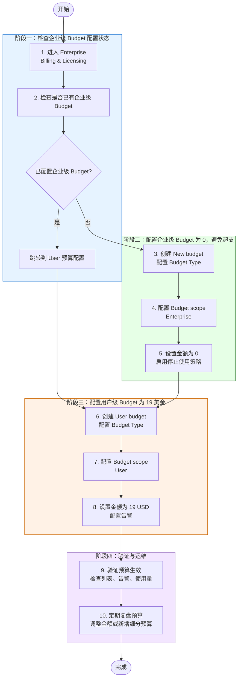

# GitHub Enterprise — 设置企业级 Budget

> **适用场景**: 在 GitHub Enterprise 中为企业级账号配置 Budget，用于监控和控制 GitHub Actions、Codespaces、Packages、Copilot premium requests 等计量型产品的费用，并通过告警通知预算负责人。

---

## 流程图

---

## 前置条件

- [ ] 拥有 GitHub Enterprise 的 **Enterprise Owner** 权限，或已被授予企业级 **Billing manager** 权限
- [ ] 企业账号已启用 GitHub 的计费与用量视图，可以访问 **Billing & Licensing**

## 操作步骤

### 步骤 1：检查是否已配置企业级 Budget

> **目的**：先确认企业级预算是否已经存在；如果已配置，则不重复创建企业级预算，直接进入 User 预算配置流程。

1. 登录 GitHub.com
2. 点击右上角头像 → **Your enterprises**
3. 选择目标 Enterprise
4. 在顶部或侧边导航中进入 **Billing & Licensing**

5. 点击 **Budgets and alerts**
6. 在 Budget 列表中检查是否已存在 Scope 为 **enterprise** 或覆盖目标企业范围的 Budget

7. 根据检查结果继续：

| 检查结果 | 后续动作 |
| --- | --- |
| 已配置企业级 Budget | 确认配置的企业Budget是否正确，是否启用停止使用策略，然后跳转到 **步骤3: User 预算** 配置流程 |
| 未配置企业级 Budget | 继续执行步骤 2，配置企业级 Budget |

> 💡 **说明**：如果看不到 **Billing & Licensing**，请确认当前账号是否具备 Enterprise Owner 或 Billing manager 权限。

---

### 步骤 2：创建新的企业级 Budget

> **目的**：创建企业级预算规则。

1. 在 **Budgets and alerts** 页面点击 **New budget**

2. 在 **Budget Type** 中选择预算类型：

---

#### 步骤 2.1：配置 Budget scope

> **目的**：定义哪些使用量会计入这个 Budget。

1. 在 **Budget scope** 区域选择 Scope
2. 按需要选择以下范围：

---

#### 步骤 2.2：设置预算金额为 0 并启用停止使用策略

> **目的**：将企业级 Budget 金额设置为 0，并在产品支持时停止继续使用，避免产生超出企业预算的计量费用。

1. 在 **Budget** 区域输入 `0 USD / month`
2. 如该产品支持阻断超额使用，勾选 **Stop usage when budget limit is reached**
3. 确认该企业级 Budget 用于防止超支，而不是只做告警监控

---

#### 步骤 2.3：配置 Budget 告警

> **目的**：当费用接近或达到预算阈值时，及时通知相关负责人。

1. 在 **Alerts** 区域勾选 **Receive budget threshold alerts**
2. 确认 GitHub 会在预算使用达到 **75% / 90% / 100%** 时发送通知
3. 在 **Alert Recipients** 中选择或添加收件人
4. 建议至少包含以下角色：

5. 点击 **Create budget** 完成创建

---

### 步骤 3：配置用户级 Budget 为 19 美金

> **目的**：为指定用户设置单独的 User Budget，将用户级预算控制在 `19 USD / month`。

1. 在 **Budgets and alerts** 页面点击 **New budget**
2. 在 **Budget Type** 中 **Boundled AI Credits Budget** 
3. 在 **Budget scope** 中选择 **User**

4. 在 **Budget** 区域输入 `19 USD / month`
5. 根据管理策略配置 **Receive budget threshold alerts** 和告警收件人
6. 点击 **Create budget** 完成用户级 Budget 创建

> 💡 **说明**：如果阶段一检查发现企业级 Budget 已存在，可以直接从这里开始配置用户级 Budget。

---

## 验证步骤

完成企业级和用户级 Budget 创建后，按以下方式验证 Budget 已生效：

1. 返回 **Billing & Licensing** → **Budgets and alerts**
2. 确认企业级 Budget 和用户级 Budget 出现在列表顶部或对应 Scope 下
3. 检查企业级 Budget 金额为 `0 USD / month`，用户级 Budget 金额为 `19 USD / month`
4. 如在 Enterprise 视图中管理多个 Scope，可使用 **Scope** 过滤器检查不同范围下的预算
5. 等待新的计量使用产生后，确认使用量开始计入对应 Budget
6. 如启用了告警，可在达到 75%、90%、100% 阈值时确认邮件和 GitHub 页面横幅通知

---

## 风险与注意事项

---

## 参考链接

- [Budgets and alerts — GitHub Docs](https://docs.github.com/en/billing/concepts/budgets-and-alerts)
- [Setting up budgets to control spending on metered products — GitHub Docs](https://docs.github.com/en/billing/how-tos/set-up-budgets)
- [Cost centers — GitHub Docs](https://docs.github.com/en/billing/concepts/cost-centers)
