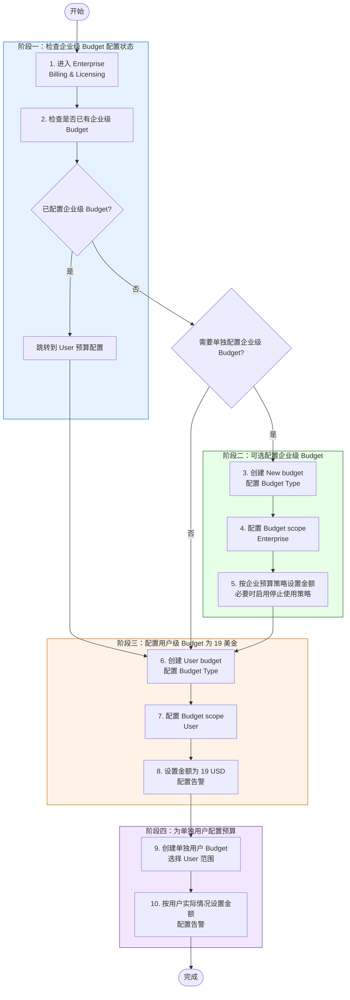
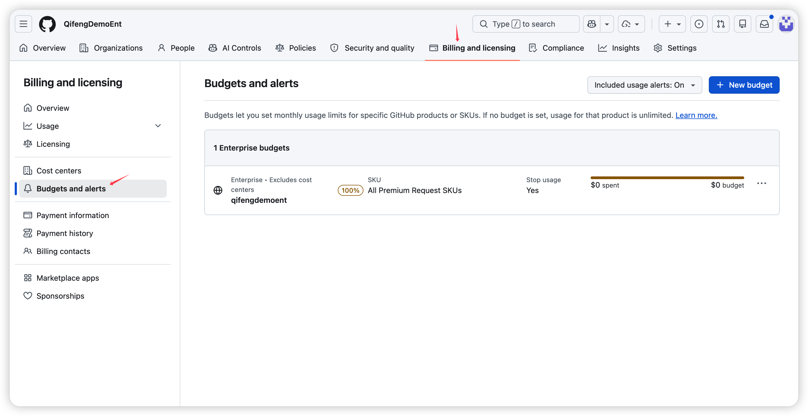
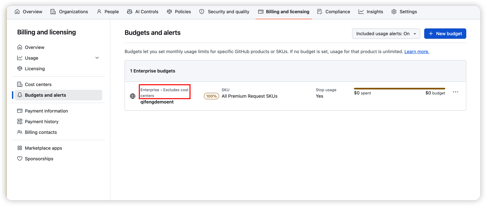
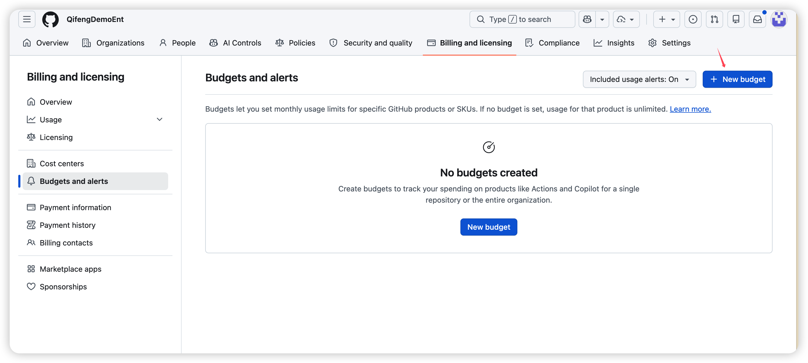
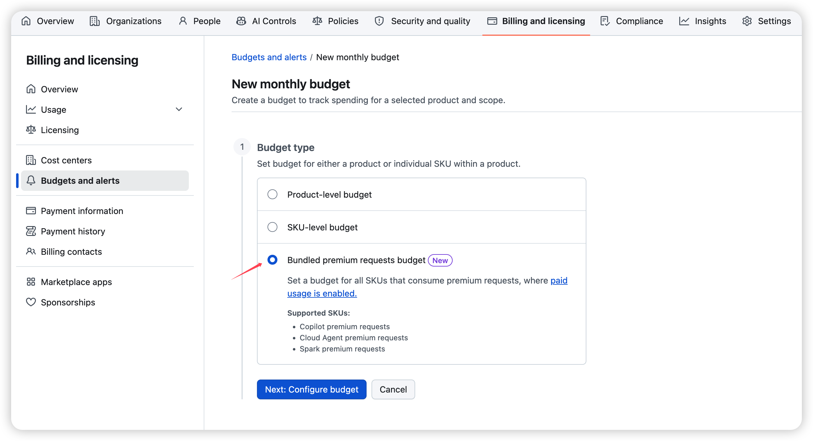
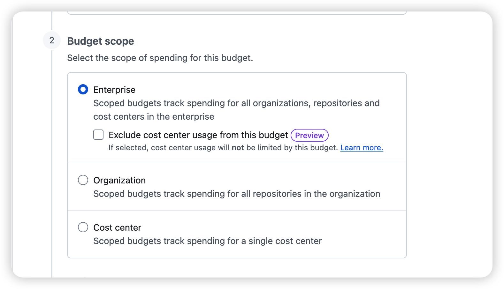
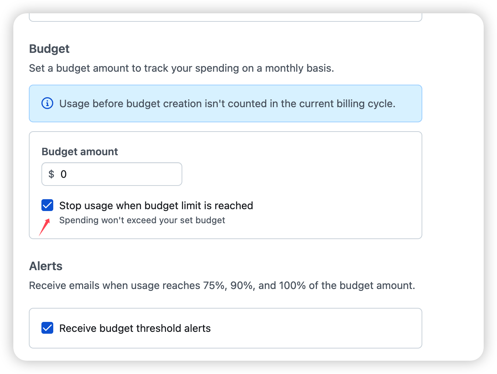
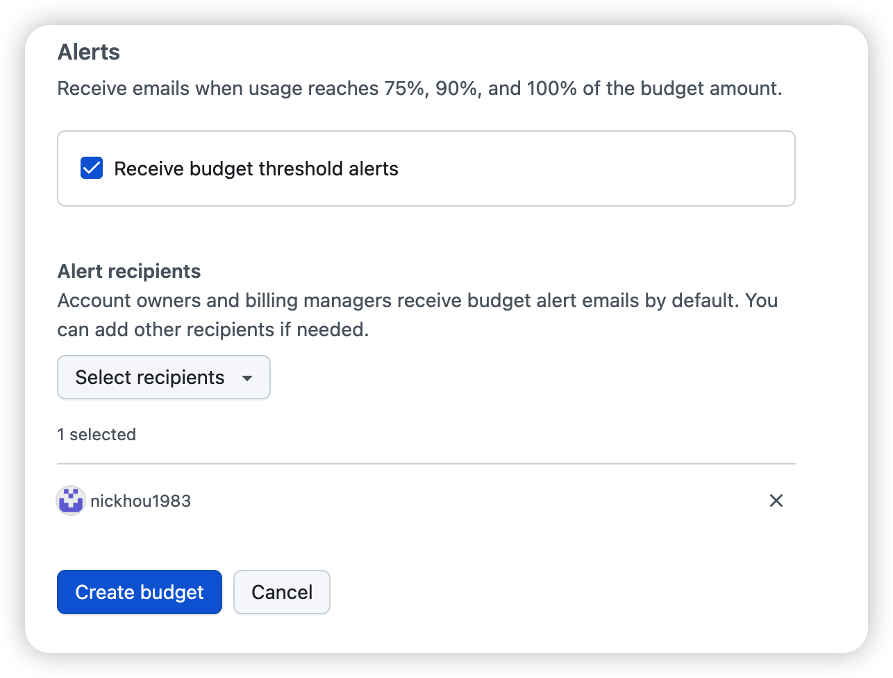
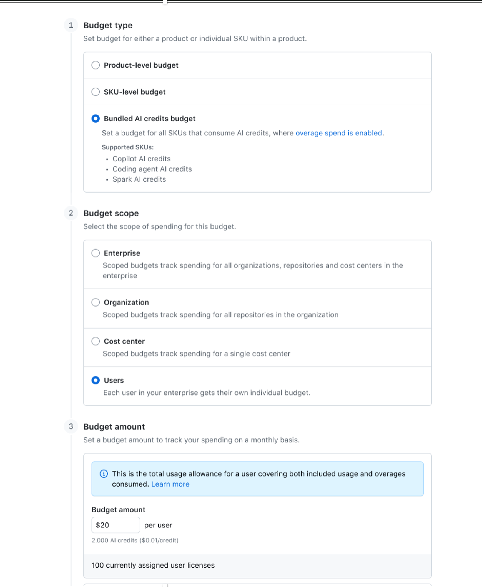

# GitHub Enterprise — 设置企业级 Budget

> **适用场景**: 在 GitHub Enterprise 中为企业级账号配置 Budget，用于监控和控制 GitHub Actions、Codespaces、Packages、Copilot premium requests 等计量型产品的费用，并通过告警通知预算负责人。

---

## 配置说明

**当前已设置的企业级 Budget / Cost Center 级Budget 会自动转换为新的 Budget 体系，转换后会保留原有的预算金额和告警设置。**

- **企业级预算**：当设置为 `0 USD / month` 时，企业内所有用户在使用完企业共享的AI Credits 共享池后，将无法继续使用 Copilot，仅能使用代码补全功能。当设置为大于 `0 USD / month` 的金额，或不设置预算时，用户在使用完企业共享 AI Credits 池后，可以继续使用 Copilot，直到达到企业级 Budget 的金额上限。

- **用户级通用预算**：为企业内所有用户设置统一使用额度。例如设置为 `19 USD / month`，则所有用户在使用了 `1900 Credits` 后，将无法继续使用 Copilot。

- **用户单独预算**：为指定用户设置单独预算，这个设置优先于用户级通用预算。例如设置为 `30 USD / month`，则该用户可以使用 `3000 Credits`。如果企业 AI Credits 共享池已用完，且企业级 Budget 设置为 `0 USD / month`，则该用户在使用完单独预算后，也无法继续使用 Copilot。

- 当前文档配置的目的是确保在 6 月 1 日转为 Credits 收费后，不会出现某些用户在短期内消耗完企业 AI Credits 资源的情况。

---

## 流程图

---

## 前置条件

- [ ] 拥有 GitHub Enterprise 的 **Enterprise Owner** 权限，或已被授予企业级 **Billing manager** 权限
- [ ] 企业账号已启用 GitHub 的计费与用量视图，可以访问 **Billing & Licensing**

## 操作步骤

### 步骤 1：检查是否已配置企业级 Budget

> **目的**：先确认企业级预算是否已经存在；如果已配置，则不重复创建企业级预算，直接进入 User 预算配置流程。

1. 登录 GitHub.com
2. 点击右上角头像 → **Your enterprises**
3. 选择目标 Enterprise
4. 在顶部或侧边导航中进入 **Billing & Licensing**

5. 点击 **Budgets and alerts**
6. 在 Budget 列表中检查是否已存在 Scope 为 **enterprise** 或覆盖目标企业范围的 Budget

7. 根据检查结果继续：

| 检查结果 | 后续动作 |
| --- | --- |
| 已配置企业级 Budget | 确认配置的企业Budget是否正确，是否启用停止使用策略，然后跳转到 **步骤3: User 预算** 配置流程 |
| 未配置企业级 Budget | 根据企业管理策略决定是否执行 **步骤2**；如果不需要单独控制企业级预算，可直接跳转到 **步骤3: User 预算** 配置流程 |

> 💡 **说明**：如果看不到 **Billing & Licensing**，请确认当前账号是否具备 Enterprise Owner 或 Billing manager 权限。

---

### 步骤 2：可选配置企业级 Budget

> **目的**：当企业需要单独控制 Enterprise 范围内的计量费用时，创建企业级预算规则；如果企业不需要单独配置企业级 Budget，可以跳过此步骤，直接进入步骤 3。

1. 在 **Budgets and alerts** 页面点击 **New budget**

2. 在 **Budget Type** 中选择预算类型：

---

#### 步骤 2.1：配置 Budget scope

> **目的**：定义哪些使用量会计入这个 Budget。

1. 在 **Budget scope** 区域选择 Scope
2. 按需要选择以下范围：

---

#### 步骤 2.2：按企业实际情况设置预算金额

> **目的**：根据企业是否有单独的企业级预算来设置金额；如果企业没有单独预算，则将企业级 Budget 设置为 `0 USD / month`，并在产品支持时停止继续使用，避免产生未规划的计量费用。

1. 先确认企业是否有单独的企业级预算额度或既定月度上限
2. 如果企业已有单独预算，按企业批准的金额在 **Budget** 区域输入对应额度
3. 如果企业没有单独预算，在 **Budget** 区域输入 `0 USD / month`
4. 如该产品支持阻断超额使用，勾选 **Stop usage when budget limit is reached**
5. 确认该企业级 Budget 的目标是与企业预算保持一致；当金额为 `0 USD / month` 时，其作用是防止超支，而不是只做告警监控

---

#### 步骤 2.3：配置 Budget 告警

> **目的**：当费用接近或达到预算阈值时，及时通知相关负责人。

1. 在 **Alerts** 区域勾选 **Receive budget threshold alerts**
2. 确认 GitHub 会在预算使用达到 **75% / 90% / 100%** 时发送通知
3. 在 **Alert Recipients** 中选择或添加收件人
4. 建议至少包含以下角色：

5. 点击 **Create budget** 完成创建

---

### 步骤 3：配置用户级 Budget 为 19 美金

> **目的**：为指定用户设置单独的 User Budget，将用户级预算控制在 `19 USD / month`。

1. 在 **Budgets and alerts** 页面点击 **New budget**
2. 在 **Budget Type** 中 **Boundled AI Credits Budget**
3. 在 **Budget scope** 中选择 **User**

4. 在 **Budget** 区域输入 `19 USD / month`
5. 根据管理策略配置 **Receive budget threshold alerts** 和告警收件人
6. 点击 **Create budget** 完成用户级 Budget 创建

> 💡 **说明**：如果阶段一检查发现企业级 Budget 已存在，可以直接从这里开始配置用户级 Budget。

---

### 步骤 4：为单独用户配置预算

> **目的**：当某些用户需要不同于默认策略的单独预算时，为该用户单独创建 User Budget，以便进行差异化控制。

1. 在 **Budgets and alerts** 页面点击 **New budget**
2. 在 **Budget Type** 中选择适用的预算类型
3. 在 **Budget scope** 中选择 **User**
4. 在用户选择范围中指定目标用户
5. 在 **Budget** 区域按该用户的实际额度输入预算金额
6. 根据管理策略配置 **Receive budget threshold alerts** 和告警收件人
7. 点击 **Create budget** 完成单独用户 Budget 创建

> 💡 **说明**：如果企业只需要统一的用户预算策略，而不需要对个别用户做差异化控制，可以跳过此步骤。

---

## 验证步骤

完成企业级、用户级以及单独用户 Budget 创建后，按以下方式验证 Budget 已生效：

1. 返回 **Billing & Licensing** → **Budgets and alerts**
2. 确认企业级 Budget、用户级 Budget，以及需要差异化控制的单独用户 Budget 出现在列表顶部或对应 Scope 下
3. 检查企业级 Budget 金额与企业预算策略一致；如果企业没有单独预算，则应为 `0 USD / month`。同时确认用户级 Budget 和单独用户 Budget 金额符合各自管理策略
4. 如在 Enterprise 视图中管理多个 Scope，可使用 **Scope** 过滤器检查不同范围下的预算
5. 等待新的计量使用产生后，确认使用量开始计入对应 Budget
6. 如启用了告警，可在达到 75%、90%、100% 阈值时确认邮件和 GitHub 页面横幅通知

---

## 风险与注意事项

- 企业级 Budget 不应机械统一设置为固定金额，应先确认企业是否存在单独预算、成本中心或内部审批上限。
- 如果企业没有单独预算，建议将企业级 Budget 设置为 `0 USD / month`，并启用可用的停止使用策略，避免产生超支费用。
- 如果企业已有明确预算额度，企业级 Budget 应与该额度保持一致，避免预算配置与财务口径不一致。
- 如果为单独用户设置了差异化预算，应明确该预算是否覆盖默认用户预算策略，避免出现重复配置或额度冲突。

---

## 参考链接

- [Budgets and alerts — GitHub Docs](https://docs.github.com/en/billing/concepts/budgets-and-alerts)
- [Setting up budgets to control spending on metered products — GitHub Docs](https://docs.github.com/en/billing/how-tos/set-up-budgets)
- [Cost centers — GitHub Docs](https://docs.github.com/en/billing/concepts/cost-centers)
