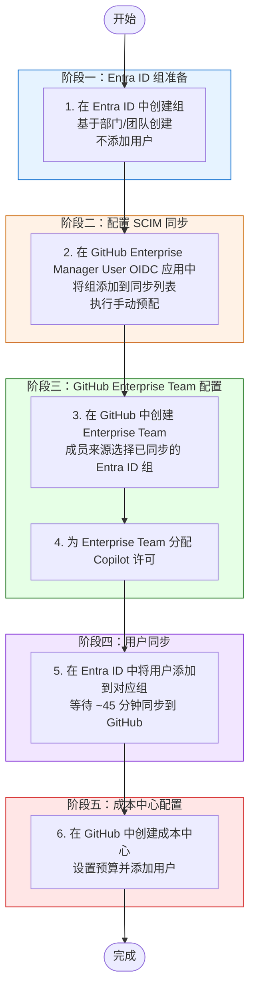

# GitHub EMU — 通过 Azure Entra ID 创建用户并配置 Copilot

> **适用场景**: 在 GitHub Enterprise Managed Users (EMU) 环境中，通过 Azure Entra ID SCIM 同步机制创建用户，配置 Enterprise Team、Copilot 许可和成本中心。

---

## 流程图

---

## 前置条件

- [ ] 拥有 Azure Entra ID 的 **Application Administrator** 或 **Cloud Application Administrator** 角色
- [ ] 拥有 GitHub Enterprise 的 **Enterprise Owner** 权限
- [ ] SCIM Provisioning 已正常工作（Token 未过期，应用未处于 Quarantine 状态）
- [ ] 已确认 GitHub Enterprise Manager User (OIDC) 应用已配置完成

---

## 操作步骤

### 步骤 1：在 Azure Entra ID 中创建组

> **目的**：为部门或团队创建安全组，作为 SCIM 同步和 GitHub 权限管理的基础单元。

1. 登录 [Azure Portal](https://portal.azure.com) → **Microsoft Entra ID** → **Groups**
2. 点击 **New group**
3. 配置组信息：

| 字段 | 值 |
|------|-----|
| Group type | Security |
| Group name | 按命名规范填写，如 `GH-<部门名>` 或 `GH-<团队名>` |
| Group description | 描述用途，如 "GitHub EMU - Engineering Team" |
| Membership type | Assigned |

4. 点击 **Create**

> ⚠️ **注意**：此步骤 **不要** 向组中添加任何用户。用户将在步骤 5 中添加。

---

### 步骤 2：在 Entra ID 应用中配置组同步

> **目的**：将新创建的组添加到 GitHub Enterprise Manager User (OIDC) 应用的 SCIM 同步范围中。

1. 在 Azure Portal 中导航到 **Enterprise applications** → 找到 **GitHub Enterprise Manager User (OIDC)** 应用
2. 点击 **Users and groups** → **Add user/group**
3. 在 **Users and groups** 选择器中搜索并选择步骤 1 中创建的组
4. 点击 **Assign**
5. 导航到 **Provisioning** → 点击 **Provision on demand**（手动预配）
6. 搜索刚添加的组，选中后点击 **Provision**
7. 确认预配结果为成功

> 💡 **说明**：手动预配可以立即将组同步到 GitHub，无需等待自动同步周期（通常 40 分钟）。

---

### 步骤 3：在 GitHub 中创建 Enterprise Team

> **目的**：创建 Enterprise Team 并关联已同步的 Entra ID 组，实现组成员自动加入 Team。

1. 登录 GitHub Enterprise → 进入 **Enterprise settings**
2. 在左侧导航中选择 **Teams**
3. 点击 **New team**
4. 配置 Team 信息：

| 字段 | 值 |
|------|-----|
| Team name | 与 Entra ID 组对应的名称 |
| Description | 团队描述 |
| Members | 选择 **Identity Provider Group**，从列表中选择已同步的 Entra ID 组 |

5. 点击 **Create team**

> 💡 **说明**：选择 Identity Provider Group 后，该组的成员将自动成为此 Enterprise Team 的成员。

---

### 步骤 4：为 Enterprise Team 分配 Copilot 许可

> **目的**：为 Enterprise Team 启用 GitHub Copilot，团队中的所有成员将自动获得 Copilot 访问权限。

1. 在 GitHub Enterprise 中导航到 **Settings** → **Copilot** → **Access**
2. 在 Copilot 许可分配页面，选择 **Enable for specific teams**（如尚未选择）
3. 点击 **Add teams**
4. 搜索并选择步骤 3 中创建的 Enterprise Team
5. 确认分配

> 💡 **说明**：通过 Team 分配 Copilot 许可，后续新加入 Team 的用户将自动获得许可。

---

### 步骤 5：在 Entra ID 中添加用户到组

> **目的**：将实际用户添加到 Entra ID 组中，触发 SCIM 同步将用户预配到 GitHub。

1. 返回 Azure Portal → **Microsoft Entra ID** → **Groups**
2. 找到步骤 1 创建的组，点击进入
3. 点击 **Members** → **Add members**
4. 搜索并选择需要同步的用户
5. 点击 **Select** 确认添加

> ⏱️ **同步时间**：用户添加后，SCIM 自动同步周期约为 **40-45 分钟**。同步完成后用户将出现在 GitHub Enterprise 中。

**验证同步状态**：
- 在 Entra ID 应用的 **Provisioning logs** 中确认用户同步成功
- 在 GitHub Enterprise 的 **People** 页面确认用户已出现
- 确认用户已自动加入对应的 Enterprise Team

---

### 步骤 6：创建成本中心并配置预算

> **目的**：在 GitHub 中创建成本中心，设置预算限制，并将用户关联到对应的成本中心进行费用管理。

1. 登录 GitHub Enterprise → 进入 **Enterprise settings**
2. 导航到 **Billing** → **Cost centers**
3. 点击 **Create cost center**
4. 配置成本中心：

| 字段 | 值 |
|------|-----|
| Name | 成本中心名称，如部门名或项目名 |
| Budget | 设置月度或年度预算金额 |

5. 创建完成后，点击进入成本中心
6. 点击 **Add members** 或 **Add teams**
7. 将步骤 5 中同步的用户或对应的 Team 添加到成本中心

> 💡 **说明**：成本中心可以帮助追踪和控制各团队的 GitHub 使用费用（包括 Copilot 许可费用）。

---

## 操作顺序说明

| 顺序 | 操作 | 原因 |
|------|------|------|
| 1 | 先创建组（不加用户） | 避免用户在权限配置完成前被同步到 GitHub |
| 2 | 配置 SCIM 同步 | 确保组结构先同步到 GitHub |
| 3 | 创建 Enterprise Team | 需要已同步的组作为成员来源 |
| 4 | 分配 Copilot 许可 | 确保用户同步后立即获得 Copilot 权限 |
| 5 | 添加用户到组 | 此时所有配置已就绪，用户同步后自动获得正确权限 |
| 6 | 配置成本中心 | 用户已存在于 GitHub 中，可以进行费用分配 |

---

## 常见问题

### Q：为什么要先创建组再添加用户？
**A**：如果先添加用户，用户可能在 Enterprise Team 和 Copilot 许可配置完成前就被同步到 GitHub，导致需要手动补充配置。按照此顺序，用户同步后会自动获得所有预配置的权限。

### Q：手动预配和自动同步有什么区别？
**A**：手动预配（Provision on demand）会立即执行同步；自动同步每 40-45 分钟执行一次。建议在步骤 2 中使用手动预配确保组立即同步，步骤 5 中添加用户后可等待自动同步。

### Q：用户同步失败怎么办？
**A**：检查 Entra ID 应用的 Provisioning logs，常见原因包括：
- SCIM Token 过期（参考 [更新 SCIM Token](../update-scim/update-scim-token-for-entra-id.md)）
- 用户属性不满足 mapping 要求
- 应用处于 Quarantine 状态

### Q：如何确认 Copilot 许可已生效？
**A**：用户同步完成后，可在 GitHub Enterprise 的 **Copilot** → **Access** 页面查看许可使用情况，确认用户显示为 Active。

---

## 相关文档

- [更新 EntraID SCIM Provisioning Token](../update-scim/update-scim-token-for-entra-id.md)
- [GitHub EMU 官方文档](https://docs.github.com/en/enterprise-cloud@latest/admin/identity-and-access-management/using-enterprise-managed-users-for-iam)
- [Entra ID SCIM Provisioning 配置指南](https://docs.github.com/en/enterprise-cloud@latest/admin/identity-and-access-management/provisioning-user-accounts-for-enterprise-managed-users/configuring-scim-provisioning-for-enterprise-managed-users)
