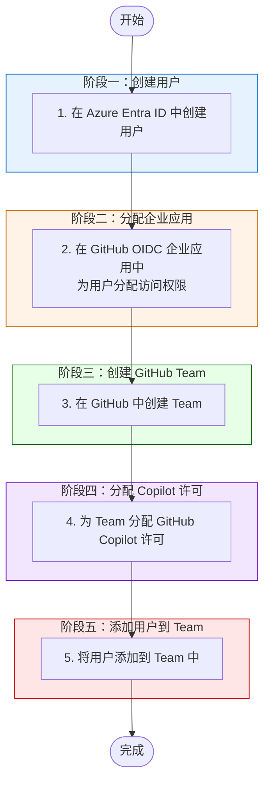

# GitHub EMU — 新用户上线并配置 Copilot 许可

> **适用场景**: 在 GitHub Enterprise Managed Users (EMU) 环境中，从 Azure Entra ID 创建用户开始，完成用户同步、Team 创建、Copilot 许可分配的完整上线流程。

---

## 流程图



---

## 前置条件

- [ ] 拥有 Azure Entra ID 的 **User Administrator** 或更高权限
- [ ] 拥有 GitHub Enterprise 的 **Enterprise Owner** 权限
- [ ] SCIM Provisioning 已正常工作（Token 未过期，应用未处于 Quarantine 状态）
- [ ] GitHub Enterprise Manager User (OIDC) 应用已配置完成

---

## 操作步骤

### 步骤 1：在 Azure Entra ID 中创建用户

> **目的**：在 Entra ID 中创建新用户帐户，作为后续同步到 GitHub 的身份来源。

1. 登录 [Azure Portal](https://portal.azure.com) → **Microsoft Entra ID** → **Users**
2. 点击 **New user** → 选择 **Create new user**
3. 填写用户信息：

| 字段 | 值 |
|------|-----|
| User principal name | 用户登录名，如 `zhangsan@contoso.com` |
| Display name | 用户显示名称 |
| First name | 名 |
| Last name | 姓 |
| Job title | 职位（可选） |
| Department | 部门（可选） |

4. 在 **Password** 部分，选择自动生成或手动设置初始密码
5. 点击 **Review + create** → **Create**

> 💡 **说明**：确保用户的 `Mail` 或 `UserPrincipalName` 属性已正确填写，这些属性将用于 SCIM 同步映射。

---

### 步骤 2：在 GitHub OIDC 企业应用中分配用户

> **目的**：将新用户分配到 GitHub Enterprise Manager User (OIDC) 应用，使其进入 SCIM 同步范围，自动预配到 GitHub。

1. 在 Azure Portal 中导航到 **Enterprise applications** → 找到 **GitHub Enterprise Manager User (OIDC)** 应用
2. 点击 **Users and groups** → **Add user/group**
3. 在 **Users** 选择器中搜索并选择步骤 1 中创建的用户
4. 点击 **Select** → **Assign**
5. 导航到 **Provisioning** → 点击 **Provision on demand**（手动预配）
6. 搜索刚分配的用户，选中后点击 **Provision**
7. 确认预配结果为成功

> ⏱️ **同步时间**：如不执行手动预配，自动同步周期约为 **40-45 分钟**。手动预配可立即完成用户同步。

**验证同步状态**：
- 在 Entra ID 应用的 **Provisioning logs** 中确认用户同步成功
- 在 GitHub Enterprise 的 **People** 页面确认用户已出现

---

### 步骤 3：在 GitHub 中创建 Team

> **目的**：创建 Team 用于组织用户并统一管理权限和 Copilot 许可。

1. 登录 GitHub Enterprise → 进入 **People** → 选择 **Enterprise Teams**
2. 点击 **New team**
3. 配置 Team 信息：

| 字段 | 值 |
|------|-----|
| Team name | 团队名称，如 `engineering-backend` |
| Description | 团队描述 |
| Team visibility | Visible（推荐）或 Secret |
| Parent team | 可选，选择父级 Team 进行嵌套管理 |

4. 点击 **Create team**

> 💡 **说明**：如果已有合适的 Team，可跳过此步骤直接使用现有 Team。

---

### 步骤 4：为 Team 分配 GitHub Copilot 许可

> **目的**：为 Team 启用 GitHub Copilot，团队中的所有成员将自动获得 Copilot 访问权限。

1. 在 GitHub Enterprise 中导航到 **Billing and License** → 选择 **Copilot**
2. 点击 **Assign License**
3. 点击 **Add teams**
4. 搜索并选择步骤 3 中创建的 Team
5. 确认分配

> 💡 **说明**：通过 Team 分配 Copilot 许可，后续新加入 Team 的用户将自动获得许可，无需逐个手动分配。

---

### 步骤 5：将用户添加到 Team 中

> **目的**：将已同步到 GitHub 的用户添加到 Team，使其自动获得 Team 关联的 Copilot 许可和仓库访问权限。

#### 方式一：手动添加单个用户

1. 在 GitHub 中导航到步骤 3 创建的 Team 页面
2. 点击 **Members** → **Add a member**
3. 搜索步骤 2 中已同步的用户（使用 GitHub 用户名，通常格式为 `<entra-id-username>_<enterprise-slug>`）
4. 选择用户并确认添加
5. 设置用户在 Team 中的角色：**Member** 或 **Maintainer**

#### 方式二：使用脚本批量添加用户到 Enterprise Team

1. 准备 CSV 文件，第一列为 GitHub 用户名：

```csv
username
zhangsan_enterprise
lisi_enterprise
wangwu_enterprise
```

1. 设置 GitHub Token：

```bash
export GITHUB_TOKEN="github_pat_xxx"
```

1. 先执行 dry-run 检查待添加用户：

```bash
python3 scripts/add-users-to-enterprise-team.py \
    --enterprise <enterprise-slug> \
    --team <enterprise-team-slug> \
    --file scripts/users-sample.csv \
    --dry-run
```

1. 确认无误后执行实际添加：

```bash
python3 scripts/add-users-to-enterprise-team.py \
    --enterprise <enterprise-slug> \
    --team <enterprise-team-slug> \
    --file scripts/users-sample.csv
```

> 💡 **说明**：脚本使用 Enterprise Team API，需要使用 Enterprise Team slug，并确保 `GITHUB_TOKEN` 具备管理 Enterprise Team 成员关系的权限。

**验证 Copilot 许可生效**：

- 在 **Settings** → **Copilot** → **Access management** 页面确认用户显示为 Active
- 用户登录 GitHub 后，在个人设置中应能看到 Copilot 已启用

---

## 操作顺序说明

| 顺序 | 操作 | 原因 |
|------|------|------|
| 1 | 创建 Entra ID 用户 | 用户是整个流程的起点 |
| 2 | 分配企业应用并触发同步 | 用户需要先同步到 GitHub 才能进行后续配置 |
| 3 | 创建 GitHub Team | Team 是许可分配和权限管理的载体 |
| 4 | 为 Team 分配 Copilot 许可 | 确保用户加入 Team 后立即获得 Copilot 权限 |
| 5 | 将用户添加到 Team | 所有配置就绪后添加用户，自动继承权限和许可 |

> 💡 **提示**：步骤 3 和步骤 4 可以在等待用户同步期间并行执行，以节省时间。

---

## 常见问题

### Q：用户同步到 GitHub 后的用户名是什么？
**A**：在 EMU 环境中，GitHub 用户名通常格式为 `<entra-id-username>_<enterprise-slug>`。例如 Entra ID 用户 `zhangsan@contoso.com`，在 Enterprise slug 为 `mycompany` 的环境中，GitHub 用户名为 `zhangsan_mycompany`。

### Q：用户已存在于 Entra ID 中，可以跳过步骤 1 吗？
**A**：可以。如果用户已存在于 Entra ID 中，直接从步骤 2 开始即可。

### Q：Team 已存在，可以跳过步骤 3 吗？
**A**：可以。如果已有合适的 Team 且已分配 Copilot 许可，直接执行步骤 5 将用户添加到该 Team 即可。

### Q：用户同步失败怎么办？
**A**：检查 Entra ID 应用的 Provisioning logs，常见原因包括：
- SCIM Token 过期（参考 [更新 SCIM Token](../update-scim/update-scim-token-for-entra-id.md)）
- 用户属性不满足 mapping 要求（如缺少必填字段）
- 应用处于 Quarantine 状态

### Q：如何批量添加多个用户？
**A**：如需批量添加用户，建议使用 Entra ID 组的方式进行管理（参考 [通过 Entra ID 组同步用户](./create-github-user-via-entra-id.md)），将用户添加到组中，通过 SCIM 同步自动完成批量预配。

### Q：Copilot 许可何时生效？
**A**：用户被添加到已分配 Copilot 许可的 Team 后，许可立即生效。用户下次登录 GitHub 或刷新页面后即可使用 Copilot。

---

## 相关文档

- [通过 Entra ID 组同步用户到 GitHub](./create-github-user-via-entra-id.md)
- [更新 EntraID SCIM Provisioning Token](../update-scim/update-scim-token-for-entra-id.md)
- [GitHub EMU 官方文档](https://docs.github.com/en/enterprise-cloud@latest/admin/identity-and-access-management/using-enterprise-managed-users-for-iam)
- [GitHub Copilot 许可管理](https://docs.github.com/en/enterprise-cloud@latest/copilot/managing-copilot/managing-github-copilot-in-your-organization/managing-access-to-github-copilot-in-your-organization)
