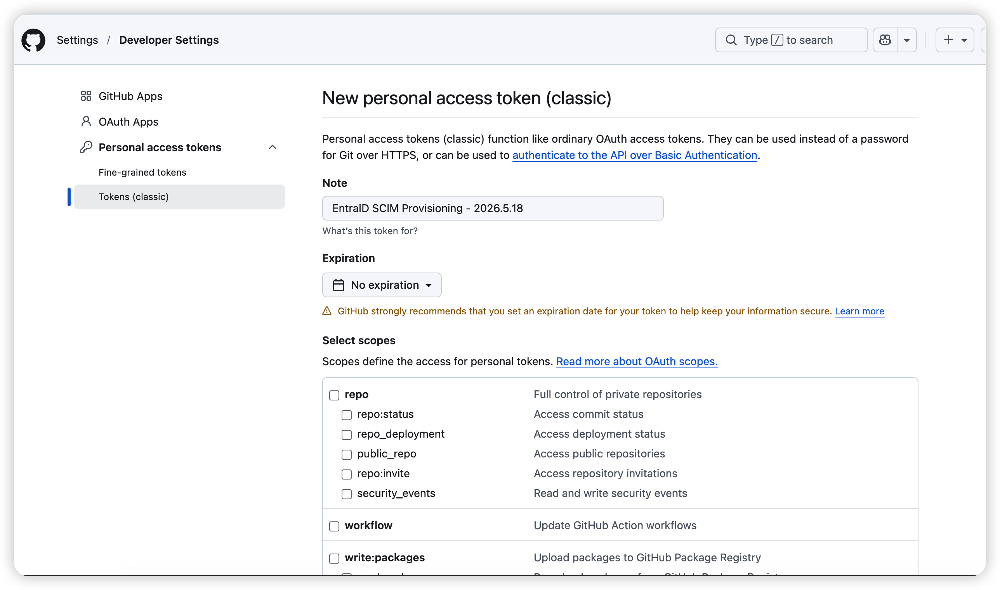
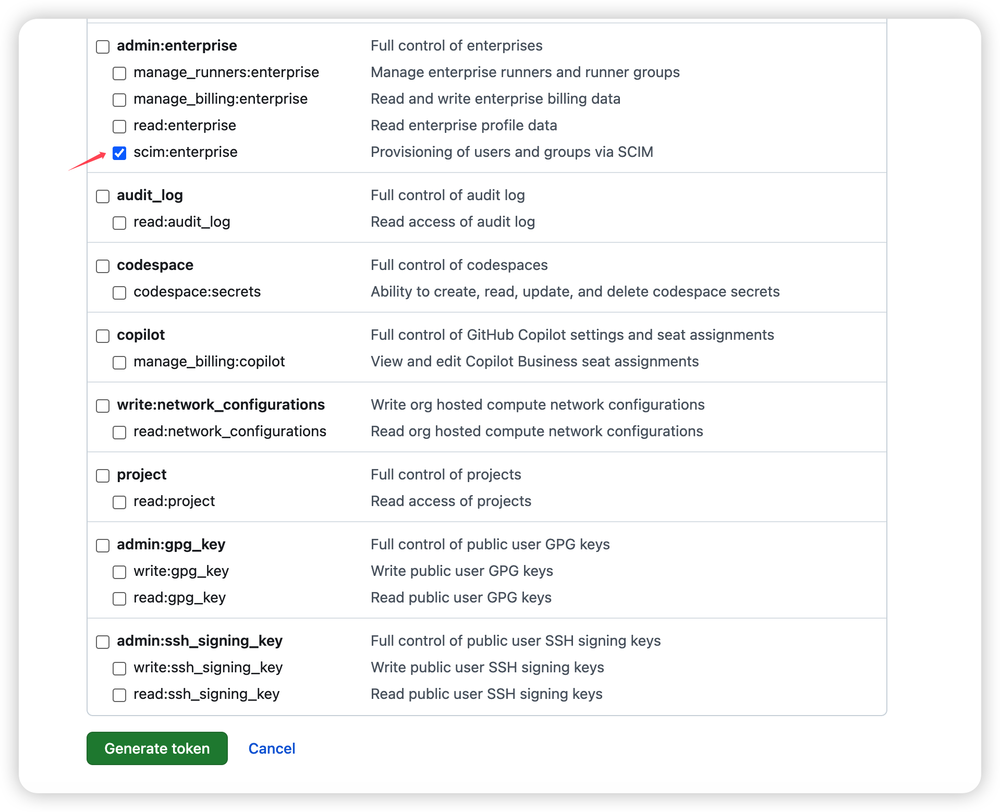
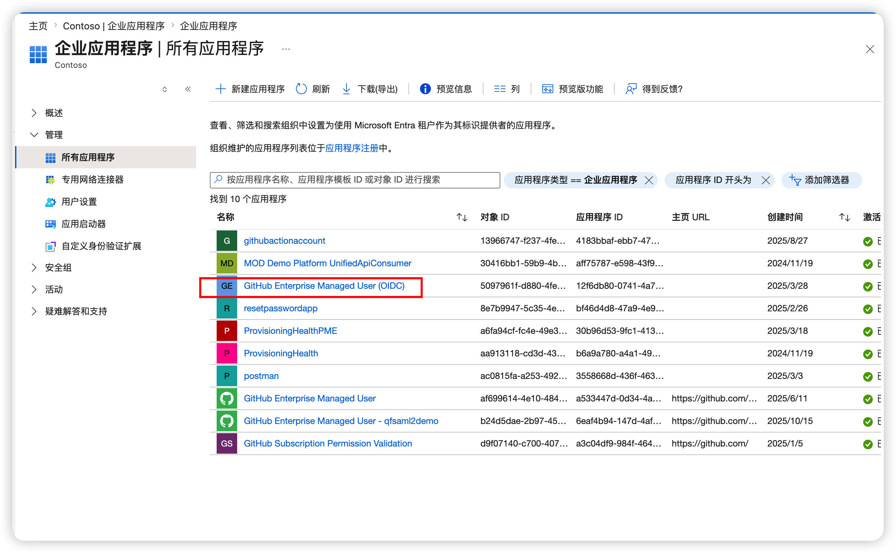
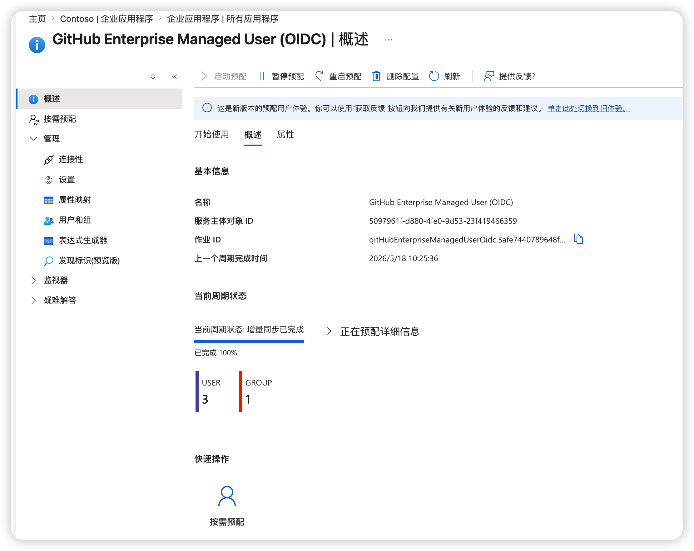
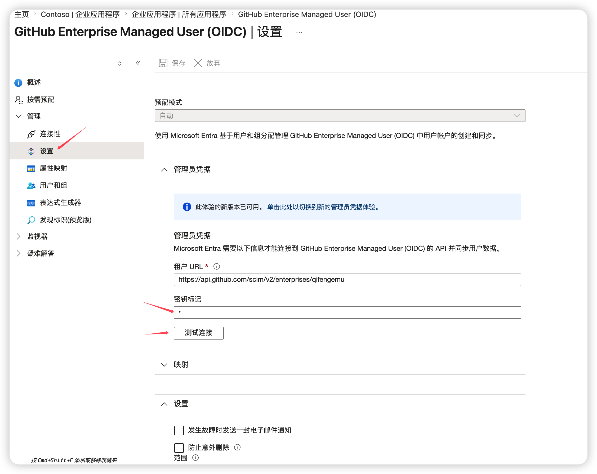

# GitHub EMU — 更新 EntraID SCIM Provisioning Token (PAT)

> **适用场景**: GitHub Enterprise Managed Users (EMU) 中，配置于 Microsoft Entra ID 的 SCIM Secret Token（即 setup user 的 PAT）即将过期或已过期，需要更新。

---

## 背景

| 项目 | 说明 |
|------|------|
| **Token 本质** | GitHub setup user (`SHORTCODE_admin`) 创建的 **Personal Access Token (classic)**，scope 为 `scim:enterprise` |
| **用途** | 作为 Entra ID → GitHub SCIM API 的认证凭据，驱动用户/组的自动 Provisioning |
| **过期影响** | Token 失效后 Provisioning 停止工作，用户创建/更新/停用/组同步全部中断，应用进入 Quarantine 状态 |
| **官方建议** | PAT 的 Expiration 设为 **No expiration** |

---

## 前置条件

- [ ] 拥有 GitHub setup user（`SHORTCODE_admin`）的登录凭据和 2FA 验证方式
- [ ] 拥有 Entra ID 的以下角色之一：Application Administrator / Cloud Application Administrator / Application Owner
- [ ] 确认当前使用的 SSO 类型（SAML 或 OIDC），以定位正确的 Enterprise App

---

## 操作步骤

### 阶段一：在 GitHub 生成新的 PAT

#### 步骤 1 — 登录 setup user

1. 打开 **隐私/无痕浏览窗口**
2. 访问 https://github.com/login
3. 使用 `SHORTCODE_admin` 账号登录（需完成 2FA 验证）

> **⚠️ 注意**: 如果忘记 setup user 密码，必须通过 [GitHub Support Portal](https://support.github.com/) 联系支持重置，常规邮件重置流程对 setup user 不可用。

#### 步骤 2 — 创建新的 PAT (classic)

1. 进入 **Settings → Developer settings → Personal access tokens → Tokens (classic)**
2. 点击 **Generate new token → Generate new token (classic)**
3. 填写配置：

| 字段 | 值 |
|------|-----|
| **Note** | `EntraID SCIM Provisioning - YYYY-MM`（替换为当前日期） |
| **Expiration** | **No expiration**（强烈推荐） |
| **Scopes** | 勾选 `scim:enterprise` |

4. 点击 **Generate token**
5. **立即复制 token 值** — 页面刷新后将无法再查看

6. 将 token 存入企业密码管理工具（如 1Password / Azure Key Vault）

> **⚠️ 重要**: 必须使用 **PAT classic**，SCIM provisioning 不支持 Fine-grained PAT。

---

### 阶段二：在 Entra ID 更新 Secret Token

#### 步骤 3 — 暂停当前 Provisioning

1. 登录 [Microsoft Entra admin center](https://entra.microsoft.com/)
2. 导航至 **Entra ID → Enterprise applications**
3. 找到并点击对应的应用：
   - OIDC 模式：**GitHub Enterprise Managed User (OIDC)**
   - SAML 模式：**GitHub Enterprise Managed User**

4. 点击 **Provisioning** 选项卡
5. 点击 **Stop provisioning**（暂停同步，避免更换期间产生失败请求）

#### 步骤 4 — 替换 Secret Token

1. 在 Provisioning 页面，点击 **Edit provisioning** 或进入已有配置
2. 展开 **Admin Credentials** 区域
3. 在 **Secret Token** 字段中，清除旧值，粘贴步骤 2 中生成的新 PAT
4. **Tenant URL** 保持不变（格式参考如下）：
   - GitHub.com: `https://api.github.com/scim/v2/enterprises/{enterprise}`
   - GHE.com: `https://api.{subdomain}.ghe.com/scim/v2/enterprises/{subdomain}`

#### 步骤 5 — 测试连接

1. 点击 **Test Connection**
2. 确认提示 **"The supplied credentials are authorized to enable provisioning"** 或类似成功消息
3. 如果测试失败，检查：
   - Token 是否正确粘贴（无多余空格）
   - PAT scope 是否包含 `scim:enterprise`
   - 是否使用了 PAT classic（非 Fine-grained）
4. 点击 **Save**

#### 步骤 6 — 重启 Provisioning

1. 返回 Provisioning Overview 页面
2. 点击 **Start provisioning**

---

### 阶段三：验证与清理

#### 步骤 7 — 验证同步正常

1. 进入 **Provisioning logs**，等待新的同步周期开始（增量同步约每 40 分钟一次）
2. 确认日志中出现成功的 Create / Update 操作
3. 如果应用之前处于 **Quarantine** 状态，确认状态已恢复为 **On**
4. （可选）使用 **Provision on demand** 功能对一名测试用户进行按需同步验证

#### 步骤 8 — 清理旧 Token

1. 回到 GitHub，以 setup user 登录
2. 进入 **Settings → Developer settings → Personal access tokens → Tokens (classic)**
3. 找到旧的（已过期或即将过期的）PAT
4. 点击 **Delete** 删除旧 token

---

## 风险与注意事项

| 风险 | 影响 | 缓解措施 |
|------|------|----------|
| Provisioning 短暂中断 | 更新期间用户变更不会同步 | 选择低峰时段操作，全流程约 10-15 分钟 |
| setup user 凭据丢失 | 无法登录则无法生成新 PAT | 确认密码管理工具中存有凭据和 2FA recovery codes |
| Scope 不足 | 连接测试失败，Provisioning 无法启动 | 创建 PAT 时仔细核对 scope |
| 使用了 Fine-grained PAT | SCIM API 不兼容，连接测试失败 | 必须使用 Tokens (classic) |
| Quarantine 未自动解除 | Provisioning 不恢复工作 | 手动点击 Restart provisioning 或等待下一个评估周期 |

---

## 长期建议

1. **Token 设置为无过期** — 避免周期性更换的运维负担，这是 GitHub 官方推荐做法
2. **建立到期提醒** — 如果企业策略要求 token 有过期时间，在日历或工单系统中设置 **到期前 30 天** 的提醒
3. **保护 setup user 凭据** — 将以下信息安全存储在企业密码管理工具中：
   - setup user 的用户名和密码
   - 2FA recovery codes
   - Enterprise recovery codes
4. **记录操作日志** — 每次更换 token 后记录操作时间、操作人、新 token 的到期时间

---

## 参考链接

- [Getting started with Enterprise Managed Users — GitHub Docs](https://docs.github.com/en/enterprise-cloud@latest/admin/managing-iam/understanding-iam-for-enterprises/getting-started-with-enterprise-managed-users)
- [Configuring SCIM provisioning for Enterprise Managed Users — GitHub Docs](https://docs.github.com/en/enterprise-cloud@latest/admin/identity-and-access-management/provisioning-user-accounts-for-enterprise-managed-users/configuring-scim-provisioning-for-enterprise-managed-users)
- [Configure GitHub EMU (OIDC) for automatic user provisioning — Microsoft Learn](https://learn.microsoft.com/en-us/entra/identity/saas-apps/github-enterprise-managed-user-oidc-provisioning-tutorial)
- [Configure GitHub EMU for automatic user provisioning (SAML) — Microsoft Learn](https://learn.microsoft.com/en-us/entra/identity/saas-apps/github-enterprise-managed-user-provisioning-tutorial)
